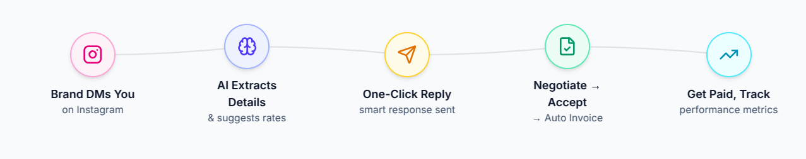
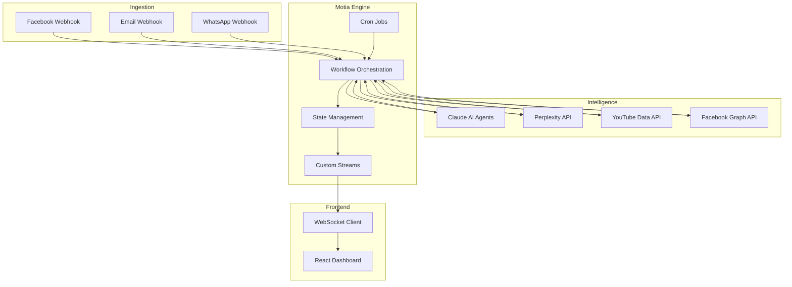
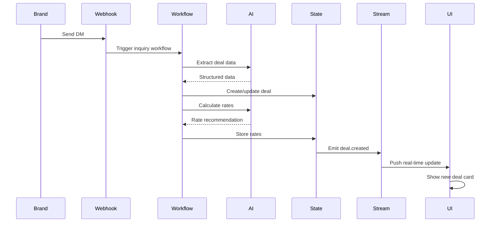
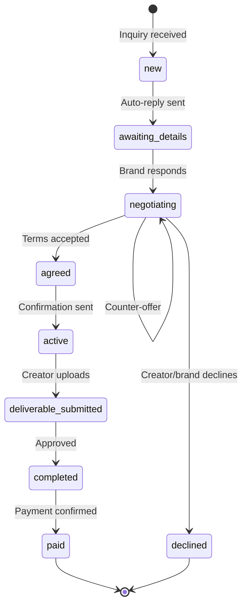
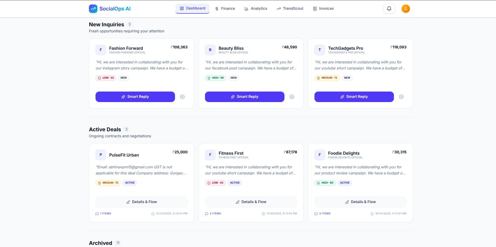
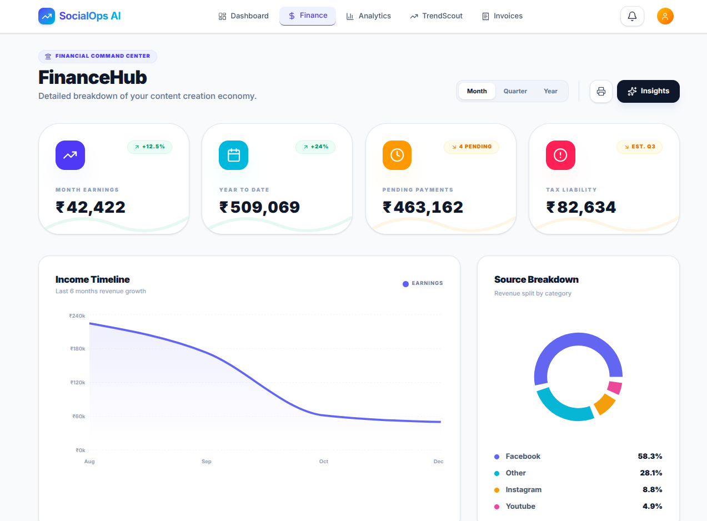
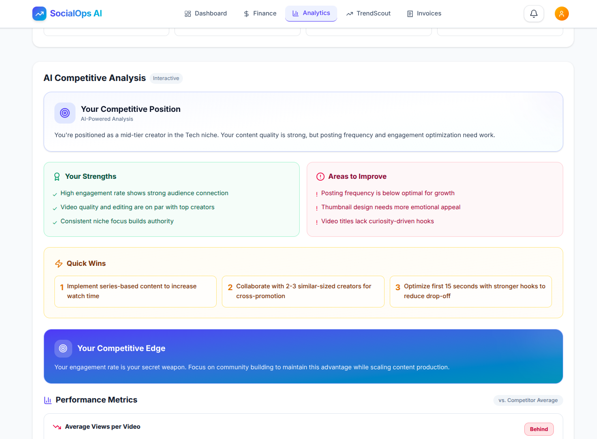
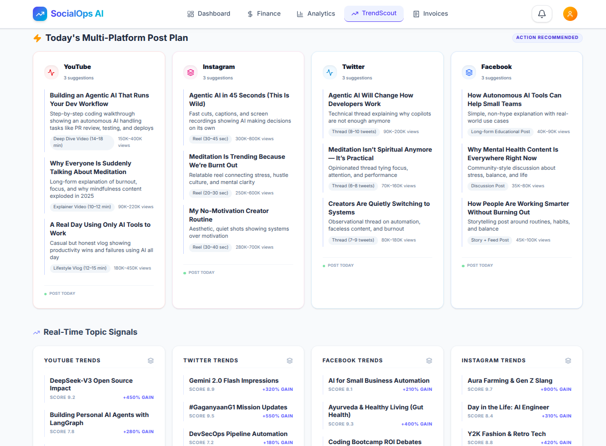

# 🚀 SocialOps AI

**AI-powered brand collaboration platform for content creators**

## 🌟 Overview

SocialOps AI is a Motia-native system that automates the complete brand partnership lifecycle for content creators. It solves the operational chaos of managing brand inquiries scattered across Instagram, Facebook, WhatsApp, and email by providing unified deal management, AI-powered negotiation assistance, competitive intelligence through peer analysis, automated invoicing, and real-time financial tracking with tax compliance. 🛠️

**Problem**: Creators lose 15+ hours weekly managing brand deals manually—juggling DMs across platforms, underpricing their work without market data, chasing payments through screenshots, and facing tax compliance nightmares. Fragmented tools and disconnected workflows result in missed opportunities and lost revenue. 😫

**Solution**: A unified operating system built on event-driven workflows that captures inquiries from any platform, provides AI-powered rate intelligence, manages negotiation cycles, generates compliant invoices, and tracks financial performance—all with real-time state synchronization. 💡

---

## ✨ What the System Does

- **📥 Unified Inquiry Capture**: Ingests brand messages from Facebook Messenger, email, and WhatsApp via webhooks
- **🧠 AI Deal Intelligence**: Extracts structured deal data, calculates market-based rates using live web research, and generates negotiation recommendations
- **🔄 Context-Aware Deal Management**: Maintains single source of truth per brand conversation with intelligent deduplication and state transitions
- **🤖 Smart Auto-Reply**: Sends pre-approved acknowledgments for high-confidence deals while flagging risky inquiries for manual review
- **🤝 Negotiation Orchestration**: Manages multi-round negotiation cycles with AI-generated counter-offers and outcome tracking
- **📄 Automated Invoicing**: Generates GST/TDS-compliant invoices with payment tracking and overdue reminders
- **📉 Financial Intelligence**: Aggregates income across platforms, calculates tax liabilities, and provides quarterly reporting
- **📊 Competitor Benchmarking**: Analyzes similar creators' performance metrics and content strategies using platform APIs
- **🔔 Real-Time Notifications**: Streams state changes to UI instantly via custom Motia Streams for deadline alerts, payment updates, and deal status changes

---

## 🔄 End-to-End Flow

### 📥 Message Ingestion → ✅ Deal Finalization

1. **Inquiry Reception**
   - Brand sends message via Facebook Messenger, email, or WhatsApp
   - Platform webhook triggers ingestion workflow
   - Message classified as brand inquiry using keyword detection and sender analysis

2. **Intelligence Layer**
   - AI agent extracts structured data: brand name, deliverables, budget hints, timeline
   - System checks existing deals to prevent duplicates (brand name + creator ID matching)
   - If existing conversation: Updates deal state with new message
   - If new: Creates deal object with status `new`

3. **Rate Calculation**
   - Fetches creator metrics from Facebook/YouTube APIs (followers, engagement rate)
   - Calculates baseline rate using formula-based approach
   - Queries Perplexity API for current market rates in creator's niche
   - Claude AI synthesizes data into three pricing tiers with reasoning

4. **Confidence Scoring & Auto-Reply**
   - AI scores deal confidence (0-100) based on niche match, budget alignment, red flags
   - High confidence (≥80): Auto-sends neutral acknowledgment ("Thanks for reaching out! Please share deliverable details...")
   - Medium/Low confidence: Queues for creator manual review
   - Deal transitions to `awaiting_details` state

5. **Negotiation Cycle**
   - Brand responds with detailed requirements
   - Creator reviews AI rate recommendation in UI
   - One-click actions: Accept, Counter (with AI-generated message), Custom amount, Decline
   - Each response tracked in negotiation history
   - Deal state transitions: `new` → `negotiating` → `agreed`

6. **Deal Activation**
   - On agreement: Generates deal confirmation summary (not formal contract)
   - Auto-emails summary to brand with deliverable timeline
   - Creates deadline tracking workflow
   - Deal state: `active`

7. **Execution & Monitoring**
   - Scheduled jobs check deadlines daily at 9 AM IST
   - Multi-channel reminders: Email (7 days before), SMS (2 days before), WhatsApp (due date)
   - Creator uploads deliverable proof → System fetches performance data from platform APIs
   - Deal state: `deliverable_submitted` → `completed`

8. **Financial Settlement**
   - Invoice auto-generated with GST (18%) and TDS (10%) calculations
   - Sent via email with PDF attachment
   - Payment tracking workflow monitors due dates
   - Overdue reminders escalate: Day +3, +7, +15
   - Deal transitions to `paid` on creator confirmation



**Context-Aware State Management**: All updates to existing conversations (brand follow-ups, clarifications, renegotiations) append to the same deal object. The system maintains conversation continuity by matching brand identity and prevents duplicate deal creation through intelligent deduplication logic.

---

## 🏗️ Architecture

### Design Principles

**Event-Driven Core**: Every user action and external trigger spawns asynchronous workflows that orchestrate multi-step processes. State changes emit events that trigger downstream workflows, enabling loose coupling and independent scaling of components.

**Layered Separation**:
- **Ingestion Layer**: Webhook handlers normalize messages from different platforms into unified format
- **Intelligence Layer**: AI agents (Claude) and external APIs (Perplexity, YouTube, Facebook) provide decision-making capabilities
- **Orchestration Layer**: Motia workflows coordinate multi-step processes with durable execution
- **Presentation Layer**: React frontend with real-time updates via Motia Streams



### Data Flow Architecture



### Workflow State Machine



---

## 📦 Core Modules

### 💸 DealFlow
Manages complete brand partnership lifecycle from inquiry capture through payment settlement. Orchestrates AI-powered rate calculation, negotiation workflows, and deadline tracking. Maintains deal state machine with transitions triggered by user actions and scheduled jobs.



### 🏦 FinanceHub
Aggregates income from multiple sources (brand deals, YouTube AdSense, affiliate programs). Calculates GST liability (18% on services), TDS deductions (10% under Section 194R), and quarterly advance tax estimates. Generates ITR-ready financial reports for chartered accountants.



### 📊 Competitor Benchmarking
Syncs analytics from Facebook and YouTube APIs hourly via cron jobs. Tracks follower growth, engagement rates, content performance across platforms. Feeds data into rate calculator and competitor benchmarking modules.



### 🔍 TrendScout
Daily web scraping job (11 PM IST) collects trending topics from YouTube, Google Trends, Twitter, and Reddit. AI analyzes trends for relevance to creator's niche, scores opportunity potential, and generates content ideas. Sends daily digest via email.



---

## 🛠️ Motia Primitives

We've leveraged Motia's core primitives to build a robust, event-driven system:

- **🔌 APIs**: Fast and reliable API endpoints that power the frontend and handle external webhooks with built-in validation.
- **⚙️ Background Jobs**: Powers our background automation, including daily deadline monitoring, hourly performance metric syncing, and nightly trend analysis.
- **📡 Streams**: Enables a snappy, real-time UI by pushing state changes directly to the dashboard over WebSockets, eliminating the need for slow polling. 🚀
- **💾 States**: Motia's persistent KV store keeps a single source of truth for all brand conversations, creator profiles, and cached market rates, ensuring no data is lost during long-running workflows.
- **🤖 Workflows (including Agentic Workflows)**: Used to orchestrate complex, multi-stage processes like the Deal Lifecycle and Automated Invoicing with durable execution and AI-driven decision making.


---

## 🛠️ Technology Stack

- **Backend Runtime**: Motia (event-driven workflow engine)
- **Frontend**: React 18 + TypeScript, Tailwind CSS, Magic UI components
- **AI & Intelligence**: Claude API (Anthropic), Perplexity Sonar API
- **Platform APIs**: Facebook Graph API, YouTube Data API v3, Twilio (WhatsApp)
- **Notifications**: SendGrid (email), Twilio (SMS)
- **Storage**: Motia built-in state management (persistent key-value store)
- **Real-Time**: Custom Motia Streams over WebSocket
- **Deployment**: Docker containers, Railway (backend), Vercel (frontend)

---

## 🚦 Getting Started

### Prerequisites 📋
- Node.js 18+
- Motia CLI installed
- API keys: Claude, Perplexity, Facebook, YouTube, SendGrid, Twilio

### Installation 💻

1. **Clone the repository**:
   ```bash
   git clone https://github.com/your-org/social-ops-ai
   cd social-ops-ai
   ```

2. **Install dependencies**:
   ```bash
   npm install
   ```

3. **Initialize environment**:
   ```bash
   cp backend/.env.example backend/.env
   ```

### 🏃 Execution

- **Full Application**: `npm run dev`
- **Backend Only**: `npm run backend`
- **Frontend Only**: `npm run app`

### Configuration 🔧

Required environment variables:
```
GROQ_API_KEY=
FB_PAGE_TOKEN=
FB_PAGE_ID=
FB_VERIFY_TOKEN=
RESEND_WEBHOOK_SIGNING_SECRET=
RESEND_API_KEY=
RESEND_FROM_EMAIL=
YOUTUBE_API_KEY=
APIFY_API_TOKEN=
```

---

## 📄 License

MIT License - See LICENSE file for details
