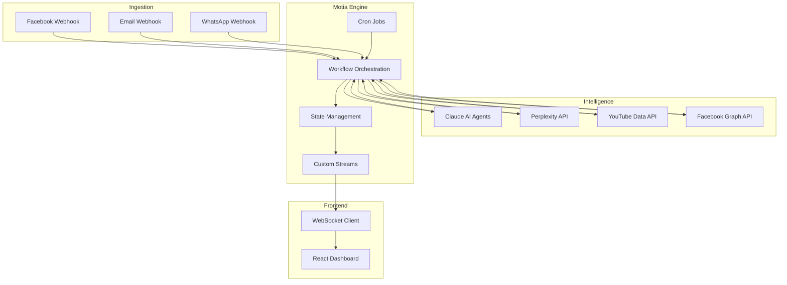
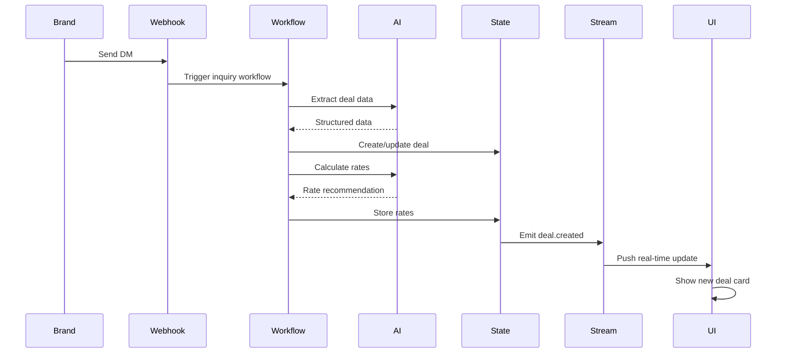
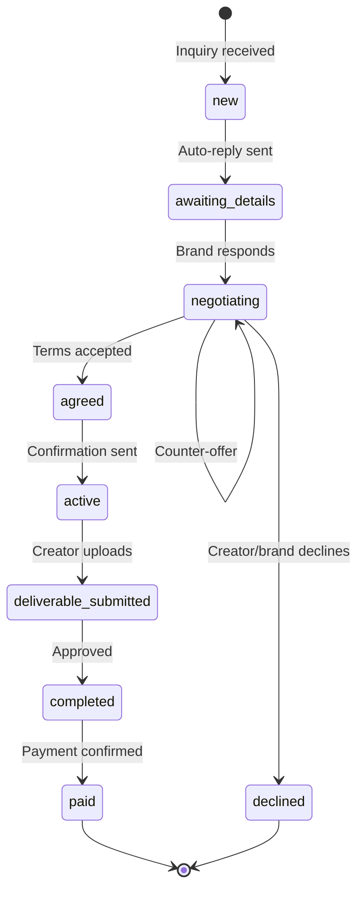

# SocialOps AI

**AI-powered brand collaboration platform for content creators**

## Overview

SocialOps AI is a Motia-native system that automates the complete brand partnership lifecycle for content creators. It solves the operational chaos of managing brand inquiries scattered across Instagram, Facebook, WhatsApp, and email by providing unified deal management, AI-powered negotiation assistance, competitive intelligence through peer analysis, automated invoicing, and real-time financial tracking with tax compliance.

**Problem**: Creators lose 15+ hours weekly managing brand deals manually—juggling DMs across platforms, underpricing their work without market data, chasing payments through screenshots, and facing tax compliance nightmares. Fragmented tools and disconnected workflows result in missed opportunities and lost revenue.

**Solution**: A unified operating system built on event-driven workflows that captures inquiries from any platform, provides AI-powered rate intelligence, manages negotiation cycles, generates compliant invoices, and tracks financial performance—all with real-time state synchronization.

---

## What the System Does

- **Unified Inquiry Capture**: Ingests brand messages from Facebook Messenger, email, and WhatsApp via webhooks
- **AI Deal Intelligence**: Extracts structured deal data, calculates market-based rates using live web research, and generates negotiation recommendations
- **Context-Aware Deal Management**: Maintains single source of truth per brand conversation with intelligent deduplication and state transitions
- **Smart Auto-Reply**: Sends pre-approved acknowledgments for high-confidence deals while flagging risky inquiries for manual review
- **Negotiation Orchestration**: Manages multi-round negotiation cycles with AI-generated counter-offers and outcome tracking
- **Automated Invoicing**: Generates GST/TDS-compliant invoices with payment tracking and overdue reminders
- **Financial Intelligence**: Aggregates income across platforms, calculates tax liabilities, and provides quarterly reporting
- **Competitor Benchmarking**: Analyzes similar creators' performance metrics and content strategies using platform APIs
- **Real-Time Notifications**: Streams state changes to UI instantly via custom Motia Streams for deadline alerts, payment updates, and deal status changes

---

## End-to-End Flow

### Message Ingestion → Deal Finalization

1. **Inquiry Reception**
   - Brand sends message via Facebook Messenger, email, or WhatsApp
   - Platform webhook triggers ingestion workflow
   - Message classified as brand inquiry using keyword detection and sender analysis

2. **Intelligence Layer**
   - AI agent extracts structured data: brand name, deliverables, budget hints, timeline
   - System checks existing deals to prevent duplicates (brand name + creator ID matching)
   - If existing conversation: Updates deal state with new message
   - If new: Creates deal object with status `new`

3. **Rate Calculation**
   - Fetches creator metrics from Facebook/YouTube APIs (followers, engagement rate)
   - Calculates baseline rate using formula-based approach
   - Queries Perplexity API for current market rates in creator's niche
   - Claude AI synthesizes data into three pricing tiers with reasoning

4. **Confidence Scoring & Auto-Reply**
   - AI scores deal confidence (0-100) based on niche match, budget alignment, red flags
   - High confidence (≥80): Auto-sends neutral acknowledgment ("Thanks for reaching out! Please share deliverable details...")
   - Medium/Low confidence: Queues for creator manual review
   - Deal transitions to `awaiting_details` state

5. **Negotiation Cycle**
   - Brand responds with detailed requirements
   - Creator reviews AI rate recommendation in UI
   - One-click actions: Accept, Counter (with AI-generated message), Custom amount, Decline
   - Each response tracked in negotiation history
   - Deal state transitions: `new` → `negotiating` → `agreed`

6. **Deal Activation**
   - On agreement: Generates deal confirmation summary (not formal contract)
   - Auto-emails summary to brand with deliverable timeline
   - Creates deadline tracking workflow
   - Deal state: `active`

7. **Execution & Monitoring**
   - Scheduled jobs check deadlines daily at 9 AM IST
   - Multi-channel reminders: Email (7 days before), SMS (2 days before), WhatsApp (due date)
   - Creator uploads deliverable proof → System fetches performance data from platform APIs
   - Deal state: `deliverable_submitted` → `completed`

8. **Financial Settlement**
   - Invoice auto-generated with GST (18%) and TDS (10%) calculations
   - Sent via email with PDF attachment
   - Payment tracking workflow monitors due dates
   - Overdue reminders escalate: Day +3, +7, +15
   - Deal transitions to `paid` on creator confirmation

**Context-Aware State Management**: All updates to existing conversations (brand follow-ups, clarifications, renegotiations) append to the same deal object. The system maintains conversation continuity by matching brand identity and prevents duplicate deal creation through intelligent deduplication logic.

---

## Architecture

### Design Principles

**Event-Driven Core**: Every user action and external trigger spawns asynchronous workflows that orchestrate multi-step processes. State changes emit events that trigger downstream workflows, enabling loose coupling and independent scaling of components.

**Layered Separation**:
- **Ingestion Layer**: Webhook handlers normalize messages from different platforms into unified format
- **Intelligence Layer**: AI agents (Claude) and external APIs (Perplexity, YouTube, Facebook) provide decision-making capabilities
- **Orchestration Layer**: Motia workflows coordinate multi-step processes with durable execution
- **Presentation Layer**: React frontend with real-time updates via Motia Streams



### Data Flow Architecture



### Workflow State Machine



---

## Core Modules

### DealFlow
Manages complete brand partnership lifecycle from inquiry capture through payment settlement. Orchestrates AI-powered rate calculation, negotiation workflows, and deadline tracking. Maintains deal state machine with transitions triggered by user actions and scheduled jobs.

### FinanceHub
Aggregates income from multiple sources (brand deals, YouTube AdSense, affiliate programs). Calculates GST liability (18% on services), TDS deductions (10% under Section 194R), and quarterly advance tax estimates. Generates ITR-ready financial reports for chartered accountants.

### PerformancePulse
Syncs analytics from Facebook and YouTube APIs hourly via cron jobs. Tracks follower growth, engagement rates, content performance across platforms. Feeds data into rate calculator and competitor benchmarking modules.

### TrendScout
Daily web scraping job (11 PM IST) collects trending topics from YouTube, Google Trends, Twitter, and Reddit. AI analyzes trends for relevance to creator's niche, scores opportunity potential, and generates content ideas. Sends daily digest via email.

### OpportunityScout
Proactive deal discovery system that monitors competitor partnerships and brand campaign launches. Uses Facebook/YouTube APIs to identify brands working with similar creators. Generates AI-powered outreach templates and tracks relationship lifecycle in CRM-style interface.

---

## Motia Primitives Used

### Workflows (`step.run`, `step.invoke`, `step.wait`)
- **Deal Lifecycle Workflow**: 16-step orchestration from inquiry ingestion through payment tracking
- **Deliverable Tracking Workflow**: Multi-stage reminder system with durable sleep between deadline checkpoints
- **Rate Calculation Workflow**: Parallel API calls to Perplexity and platform APIs with AI synthesis
- **Invoice Generation Workflow**: Sequential steps for PDF creation, email delivery, and payment tracking

### Scheduled Jobs (`cron`)
- **Deadline Monitor**: Daily (9 AM IST) - Scans all active deals, sends multi-channel reminders based on urgency
- **Performance Sync**: Hourly - Fetches latest metrics from Facebook/YouTube with rate limit handling
- **Trend Analyzer**: Daily (11 PM IST) - Scrapes trending topics, runs AI analysis, generates content ideas
- **Payment Tracker**: Daily (10 PM IST) - Monitors overdue invoices, escalates reminders progressively
- **GST Prep**: Monthly (25th) - Aggregates invoices, calculates net GST payable after ITC

### State Management
- **Persistent Deal Objects**: Complete audit trail of all state transitions, negotiation history, performance data
- **Creator Profiles**: Metrics, preferences, financial settings, bank details stored with versioning
- **Market Rate Cache**: 24-hour TTL on Perplexity API results to minimize costs (reduces queries by ~90%)
- **Competitor Data Store**: Historical performance snapshots for trend analysis

### Custom Motia Streams
**Why Streams Were Introduced**: Traditional polling creates unnecessary load and introduces latency (1-5 second delays). WebSocket connections enable sub-second UI updates for time-sensitive operations like deadline alerts and payment notifications.

**Implementation**:
- `deal.created` - New inquiry arrives → UI instantly shows card in dashboard
- `deal.status_changed` - State transitions → UI updates badges and moves cards between columns
- `deliverable.deadline_approaching` - Cron job detects upcoming deadline → Real-time banner alert in UI
- `payment.received` - Creator confirms payment → Dashboard earnings counter animates
- `invoice.overdue` - Payment tracking detects overdue → Red notification badge appears
- `competitor.data_refreshed` - Background analysis completes → Benchmarking dashboard updates

**Stream Architecture**:
- Backend workflows emit events to Motia Stream bus
- Frontend establishes WebSocket connection on authentication
- Stream consumer filters events by `creatorId` for multi-tenancy
- UI components subscribe to specific event types and update local state
- Connection resilience with automatic reconnection and event replay

---

## Real-Time UI & State Sync

### Problem Statement
Polling-based updates create two issues:
1. **Latency**: 3-5 second delay between backend state change and UI reflection
2. **Resource Waste**: Constant API requests even when no changes occur

### Stream-Based Solution
Backend state mutations trigger events that stream directly to connected clients. Frontend maintains optimistic UI with immediate feedback, then reconciles with authoritative backend state on stream receipt.

**Example Flow**:
1. Creator clicks "Accept Deal"
2. UI optimistically updates card to "Accepted" state
3. API request triggers workflow
4. Workflow updates state to `agreed` and emits `deal.status_changed` event
5. Stream delivers event to UI within 100ms
6. UI reconciles optimistic update with authoritative state
7. Workflow continues to generate confirmation email (async)
8. Email sent → `deal.confirmation_sent` event → UI shows "Sent" badge

**Benefits**:
- Sub-second responsiveness for user actions
- Live updates across multiple browser tabs
- No polling overhead (reduces backend load by ~80%)
- Natural support for collaborative features (future: multi-user teams)

---

## Design & Reliability Decisions

### Idempotency
All webhook handlers and workflow entry points implement idempotency keys to handle duplicate deliveries. Facebook webhooks frequently retry on network issues; system deduplicates using `messageId` + `creatorId` hash before workflow invocation.

### Deal Identity & State Transitions
Deals identified by composite key: `(brandName.normalized, creatorId)`. Normalization handles variations ("TechGadgets India" vs "techgadgets") using fuzzy matching. State machine enforces valid transitions; invalid operations (e.g., accepting already-declined deal) are rejected with error logging.

### Failure Handling
**Transient Failures**: Motia's durable execution automatically retries failed steps with exponential backoff. External API timeouts (Perplexity, YouTube) fallback to cached data or baseline calculations.

**Permanent Failures**: Invalid webhooks (malformed JSON, missing required fields) logged to error stream with alert to operations dashboard. User-facing errors display actionable messages ("Unable to fetch market rates - using baseline calculation").

**Compensation**: Payment tracking workflows implement compensation logic: if invoice email fails, workflow retries 3x with increasing delays, then flags deal for manual intervention rather than silently failing.

### Data Consistency
State updates wrapped in transactions where Motia guarantees atomic writes. Deal negotiations append to history array; concurrent updates use last-write-wins with conflict detection. Critical operations (payment confirmation) require explicit user action to prevent race conditions.

---

## Extensibility

### Platform Expansion
Ingestion layer abstraction allows new platforms with minimal changes:
1. Add webhook handler for platform (Instagram, LinkedIn, Discord)
2. Implement message normalization to standard format
3. Register platform-specific authentication flow
4. All downstream workflows operate on normalized data unchanged

### Workflow Modularity
Each module invokes sub-workflows independently. Adding "Contract Generation" feature requires:
- New workflow for DocuSign integration
- Emit `deal.contract_generated` event
- UI subscribes to event for real-time status update
- No changes to existing negotiation or invoicing workflows

### AI Model Flexibility
Rate calculator abstracts AI provider behind interface. Switching from Claude to GPT-4 requires implementing `RateCalculatorAgent` interface—no changes to workflow orchestration. Supports A/B testing different models for quality comparison.

### Multi-Tenancy
Creator isolation enforced at state layer via `creatorId` scoping. Adding agency/team features requires:
- Group-level permissions model
- Stream filtering by `teamId` instead of `creatorId`
- Aggregated dashboards across team members
- Core workflows remain creator-scoped, orchestration layer handles aggregation

### International Markets
System designed for India (GST/TDS) but extensible:
- Tax calculation plugins per jurisdiction
- Currency handling with exchange rate API
- Locale-specific invoice templates
- Market rate data sources per region

**Scaling Strategy**: Current architecture supports 10K creators on single Motia instance. Horizontal scaling achieved by partitioning workflows by `creatorId` hash across multiple Motia runtimes. Stateless intelligence layer (AI APIs) scales independently.

---

## Technology Stack

- **Backend Runtime**: Motia (event-driven workflow engine)
- **Frontend**: React 18 + TypeScript, Tailwind CSS, Magic UI components
- **AI & Intelligence**: Claude API (Anthropic), Perplexity Sonar API
- **Platform APIs**: Facebook Graph API, YouTube Data API v3, Twilio (WhatsApp)
- **Notifications**: SendGrid (email), Twilio (SMS)
- **Storage**: Motia built-in state management (persistent key-value store)
- **Real-Time**: Custom Motia Streams over WebSocket
- **Deployment**: Docker containers, Railway (backend), Vercel (frontend)

---

## Getting Started

### Prerequisites
- Node.js 18+
- Motia CLI installed
- API keys: Claude, Perplexity, Facebook, YouTube, SendGrid, Twilio

### Installation

```bash
# Clone repository
git clone https://github.com/your-org/socialops-ai
cd socialops-ai

# Install dependencies
npm install

# Configure environment
cp .env.example .env
# Edit .env with your API keys

# Initialize Motia
motia init

# Start backend
motia dev

# Start frontend (separate terminal)
cd frontend
npm run dev
```

### Configuration

Required environment variables:
```
CLAUDE_API_KEY=
PERPLEXITY_API_KEY=
FACEBOOK_APP_ID=
FACEBOOK_APP_SECRET=
YOUTUBE_API_KEY=
SENDGRID_API_KEY=
TWILIO_ACCOUNT_SID=
TWILIO_AUTH_TOKEN=
```

### Running in Production

```bash
# Build frontend
cd frontend && npm run build

# Deploy to Railway (backend)
railway up

# Deploy to Vercel (frontend)
vercel --prod
```

---

## License

MIT License - See LICENSE file for details
