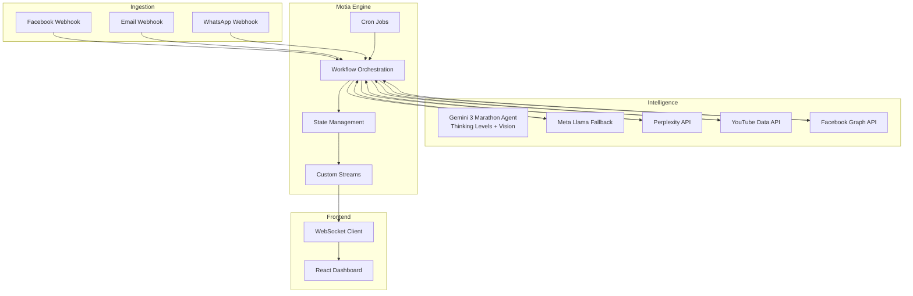

# 🚀 SocialOps AI

**AI-powered brand collaboration platform for content creators**

## 🌟 Overview

SocialOps AI is a **Gemini 3-powered Marathon Agent** and Motia-native system that **autonomously runs** the complete brand partnership lifecycle for content creators. It solves the operational chaos of managing brand inquiries scattered across Instagram, Facebook, WhatsApp, and email by providing unified deal management, **autonomous AI negotiation**, competitive intelligence through peer analysis, automated invoicing with **browser-based verification**, and real-time financial tracking with tax compliance. 🛠️

**Problem**: Creators lose 15+ hours weekly managing brand deals manually: juggling DMs across platforms, underpricing their work without market data, chasing payments through screenshots, and facing tax compliance nightmares. Fragmented tools and disconnected workflows result in missed opportunities and lost revenue. 😫

**Solution**: A unified **autonomous operating system** built on **Gemini 3's Thinking Levels and Vision API**, event-driven workflows, and multimodal verification that captures inquiries from any platform, provides strategic rate intelligence, **autonomously negotiates deals across multiple rounds**, generates compliant invoices, **verifies them via browser automation**, and tracks financial performance: all with real-time state synchronization. 💡

---

## 🏆 Gemini 3 Hackathon: Marathon Agent Transformation

### What Makes This a Marathon Agent

SocialOps AI leverages **Gemini 3's unique capabilities** to transform from an AI assistant into a **fully autonomous Marathon Agent** that runs multi-day workflows without human intervention:

**🧠 Thinking Levels for Strategic Decisions**
- **Level 2 Deep Thinking** analyzes brand counter-offers with game theory reasoning
- Considers urgency signals, budget constraints, and competitive dynamics
- Makes strategic negotiation decisions autonomously

**🎯 Thought Signatures for Marathon Context**
- Maintains reasoning across 50+ tool calls spanning 7-30 day deal lifecycles
- Remembers "Brand mentioned urgent timeline" from Day 1 inquiry on Day 5 negotiation
- Self-corrects strategy when new information arrives

**👁️ Vision API for Multimodal Verification**
- Analyzes invoice PDFs via browser screenshots
- Verifies GSTIN format (15 characters), GST calculations (18%), required fields
- Checks social media posts for ASCI #Ad compliance disclosures
- Analyzes competitor Instagram grids for content strategy insights

**☯️ Vibe Engineering: Self-Verifying Agent**
- Generates GST invoice PDF → Opens in Playwright browser → Screenshots → Gemini Vision analyzes → Detects errors → Self-corrects → Regenerates → Verifies again
- Creates browser recording artifacts proving verification loops
- Achieves 99%+ invoice accuracy through autonomous testing

### Autonomous Negotiation Flow

```mermaid
sequenceDiagram
    participant Brand
    participant Agent
    participant Gemini
    
    Brand->>Agent: Offers ₹15K for Reel
    Agent->>Gemini: Analyze with Level 2 Thinking
    Gemini-->>Agent: "40% below market, counter ₹25K"
    Agent->>Brand: Auto-sends counter-proposal
    
    Brand->>Agent: Counters ₹20K
    Agent->>Gemini: Re-analyze with thought signature
    Gemini-->>Agent: "80% threshold met, ACCEPT"
    
    Agent->>Agent: Generate invoice PDF
    Agent->>Gemini: Vision: Verify via browser
    Gemini-->>Agent: "GSTIN error detected"
    Agent->>Gemini: Self-correct format
    Agent->>Agent: Regenerate + verify
    Gemini-->>Agent: "PASS ✓"
    
    Agent->>Brand: Email signed contract
```



**Result:** Full deal lifecycle from inquiry to contract, **zero human clicks**, 2-3 minutes execution time.

---

## ✨ What the System Does

- **📥 Unified Inquiry Capture**: Ingests brand messages from Facebook Messenger, email, and WhatsApp via webhooks
- **🧠 AI Deal Intelligence**: Extracts structured deal data with **Gemini 3 multimodal analysis**, calculates market-based rates using Thinking Level 2 strategic reasoning, and generates autonomous negotiation decisions
- **🔄 Context-Aware Deal Management**: Maintains single source of truth per brand conversation with intelligent deduplication and state transitions
- **🤖 Smart Auto-Reply**: Sends pre-approved acknowledgments for high-confidence deals while flagging risky inquiries for manual review
- **🤝 Autonomous Negotiation**: Runs multi-round negotiation cycles **fully autonomously** with Gemini 3 Level 2 strategic thinking and self-correcting offer optimization
- **📄 Self-Verifying Invoicing**: Generates GST/TDS-compliant invoices, **verifies them via browser + Gemini Vision**, self-corrects errors, and tracks payments with overdue reminders
- **📉 Financial Intelligence**: Aggregates income across platforms, calculates tax liabilities, and provides quarterly reporting
- **📊 Competitor Benchmarking**: Analyzes similar creators' performance metrics and content strategies using platform APIs
- **🔔 Real-Time Notifications**: Streams state changes to UI instantly via custom Motia Streams for deadline alerts, payment updates, and deal status changes

---

## 🔄 End-to-End Flow

### 📥 Message Ingestion → ✅ Deal Finalization

1. **Inquiry Reception**
   - Brand sends message via Facebook Messenger, email, or WhatsApp
   - Platform webhook triggers ingestion workflow
   - Message classified as brand inquiry using keyword detection and sender analysis

2. **Intelligence Layer**
   - AI agent extracts structured data: brand name, deliverables, budget hints, timeline
   - System checks existing deals to prevent duplicates (brand name + creator ID matching)
   - If existing conversation: Updates deal state with new message
   - If new: Creates deal object with status `new`

3. **Rate Calculation**
   - Fetches creator metrics from Facebook/YouTube APIs (followers, engagement rate)
   - Calculates baseline rate using formula-based approach
   - Queries Perplexity API for current market rates in creator's niche
   - **Gemini 3 with Thinking Level 2** synthesizes data into three strategic pricing tiers with game-theory reasoning (or Meta Llama fallback)

4. **Confidence Scoring & Auto-Reply**
   - AI scores deal confidence (0-100) based on niche match, budget alignment, red flags
   - High confidence (≥80): Auto-sends neutral acknowledgment ("Thanks for reaching out! Please share deliverable details...")
   - Medium/Low confidence: Queues for creator manual review
   - Deal transitions to `awaiting_details` state

5. **Negotiation Cycle**
   - Brand responds with detailed requirements
   - Creator reviews AI rate recommendation in UI
   - One-click actions: Accept, Counter (with AI-generated message), Custom amount, Decline
   - Each response tracked in negotiation history
   - Deal state transitions: `new` -> `negotiating` -> `agreed`

6. **Deal Activation**
   - On agreement: Generates deal confirmation summary (not formal contract)
   - Auto-emails summary to brand with deliverable timeline
   - Creates deadline tracking workflow
   - Deal state: `active`

7. **Execution & Monitoring**
   - Scheduled jobs check deadlines daily
   - Multi-channel reminders: Email (7 days before), WhatsApp (2 days before), WhatsApp (due date)
   - Creator uploads deliverable proof: System fetches performance data from platform APIs
   - Deal state: `deliverable_submitted` -> `completed`

8. **Financial Settlement**
   - Invoice auto-generated with GST (18%) and TDS (10%) calculations
   - Sent via email with PDF attachment
   - Payment tracking workflow monitors due dates
   - Overdue reminders escalate: Day +3, +7, +15
   - Deal transitions to `paid` on creator confirmation


**Context-Aware State Management**: All updates to existing conversations (brand follow-ups, clarifications, renegotiations) append to the same deal object. The system maintains conversation continuity by matching brand identity and prevents duplicate deal creation through intelligent deduplication logic.

---

## 🏗️ Architecture

### Design Principles

**Event-Driven Core**: Every user action and external trigger spawns asynchronous workflows that orchestrate multi-step processes. State changes emit events that trigger downstream workflows, enabling loose coupling and independent scaling of components.

**Layered Separation**:
- **Ingestion Layer**: Webhook handlers normalize messages from different platforms into unified format
- **Intelligence Layer**: **Gemini 3 (Thinking Levels + Vision API)**, Meta Llama (fallback), and external APIs (Perplexity, YouTube, Facebook) provide autonomous decision-making capabilities
- **Orchestration Layer**: Motia workflows coordinate multi-step processes with durable execution and thought signature persistence
- **Presentation Layer**: React frontend with real-time updates via Motia Streams
- **Verification Layer**: Playwright browser automation + Gemini Vision for self-verifying PDF generation



### Data Flow Architecture


### Workflow State Machine


---

## 📦 Core Modules

### 💸 DealFlow
Manages complete brand partnership lifecycle from inquiry capture through payment settlement. Orchestrates AI-powered rate calculation, negotiation workflows, and deadline tracking. Maintains deal state machine with transitions triggered by user actions and scheduled jobs.


### 🏦 FinanceHub
Aggregates income from multiple sources (brand deals, YouTube AdSense, affiliate programs). Calculates GST liability (18% on services), TDS deductions (10% under Section 194R), and quarterly advance tax estimates. Generates ITR-ready financial reports for chartered accountants.


### 📊 Competitor Benchmarking
Syncs analytics from Facebook and YouTube APIs via parallel Motia jobs. Tracks follower growth, engagement rates, and content performance across platforms simultaneously. Orchestrates multi-platform workflows with real-time state synchronization, feeding fresh data into the rate calculator and benchmarking modules.


### 🔍 TrendScout
Orchestrates parallel Motia jobs to collect trending signals from YouTube, Google Trends, Twitter, Facebook, and Instagram. Meta Llama analyzes these multi-platform signals to score opportunity potential and generate niche-specific content ideas. Google Trends analysis is fully automated within the workflow, requiring no external API key. Sends a consolidated daily digest via email.


---

## 🛠️ Motia Primitives

We've leveraged Motia's core primitives to build a robust, event-driven system:

- **🔌 APIs**: Fast and reliable API endpoints that power the frontend and handle external webhooks with built-in validation.
- **⚙️ Background Jobs**: Powers our background automation, including daily deadline monitoring, hourly performance metric syncing, and nightly trend analysis.
- **📡 Streams**: Enables a snappy, real-time UI by pushing state changes directly to the dashboard over WebSockets, eliminating the need for slow polling. 🚀
- **💾 States**: Motia's persistent KV store keeps a single source of truth for all brand conversations, creator profiles, and cached market rates, ensuring no data is lost during long-running workflows.
- **🤖 Workflows (including Agentic Workflows)**: Used to orchestrate complex, multi-stage processes like the Deal Lifecycle and Automated Invoicing with durable execution and AI-driven decision making.

---

## 🛠️ Technology Stack

- **Backend Runtime**: Motia (event-driven workflow engine)
- **Frontend**: React 18 + TypeScript, Tailwind CSS, Magic UI components
- **AI & Intelligence**: 
  - **Gemini 3 API** (gemini-2.0-flash-exp) - Marathon Agent with Thinking Levels
  - **Gemini Vision API** - Multimodal PDF/image verification
  - **Meta Llama 4** (Groq) - Fallback AI provider
  - **Perplexity Sonar API** - Market research
- **Browser Automation**: Playwright + Chromium (PDF verification)
- **Platform APIs**: Facebook Graph API, YouTube Data API v3, WhatsApp Business API
- **Notifications**: Resend (email), WhatsApp
- **Storage**: Motia built-in state management (persistent key-value store)
- **Real-Time**: Custom Motia Streams over WebSocket
- **Deployment**: Docker containers

---

## 🚦 Getting Started

### Prerequisites 📋
- Node.js 18+
- Motia CLI installed
- **API keys**: Gemini 3 (from AI Studio), Groq (fallback), Perplexity, Facebook, YouTube, Resend, WhatsApp Business API
- Playwright browsers (auto-installed)

### Installation 💻

1. **Clone the repository**:
   ```bash
   git clone https://github.com/your-org/social-ops-ai
   cd social-ops-ai
   ```

2. **Install dependencies**:
   ```bash
   cd backend
   npm install
   npx playwright install chromium  # For browser verification
   
   cd ../app
   npm install
   ```

3. **Initialize environment**:
   ```bash
   cp backend/.env.example backend/.env
   ```

### 🏃 Execution

- **Full Application**: `npm run dev`
- **Backend Only**: `npm run backend`
- **Frontend Only**: `npm run app`

### Configuration 🔧

Required environment variables:
```bash
# AI Integration (Gemini 3 for Marathon Agent features)
GEMINI_API_KEY=          # Get from https://aistudio.google.com/apikey
GROQ_API_KEY=            # Fallback AI provider
PERPLEXITY_API_KEY=      # Market research

# Social Platform Integrations
FB_PAGE_TOKEN=
FB_PAGE_ID=
FB_VERIFY_TOKEN=
YOUTUBE_API_KEY=

# Notifications & Services
RESEND_API_KEY=
RESEND_FROM_EMAIL=
RESEND_WEBHOOK_SIGNING_SECRET=
APIFY_API_TOKEN=
```

---

## 📄 License

MIT License - See LICENSE file for details
